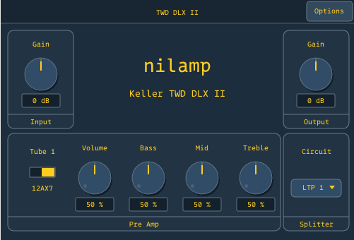
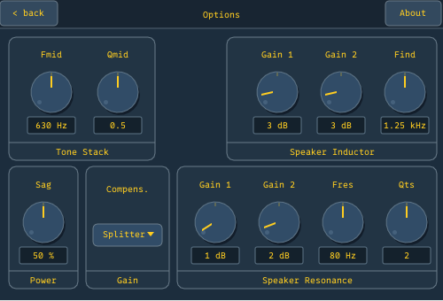

# nilamp

nilamp is a native C CLAP guitar amp plugin based on Helmut Keller's
["A Tube Amp Modeling Project"](https://www.helmutkelleraudio.de/). The current
model is Keller TWD DLX II, modeled after a Fender Tweed Deluxe with a more
versatile tone stack. The code is shaped for more amps later.

The name means "no amp": `nil` + `amp`.

## Screenshots





## Status

The active build is a native C DSP engine, Make-built offline renderers, and a
C CLAP plugin with an embedded GPU editor. The target format is CLAP. Linux,
macOS, and Windows are supported native targets.

Current editor backends are X11/XWayland on Linux, Cocoa on macOS, and Win32 on
Windows. Native Wayland support is future work.

## Goals

- Native CLAP plugin with no YSFX wrapper dependency
- Multi-amp platform: 5E3 -> Bassman -> Plexi -> AC30 -> Twin -> ...
- Realtime tweakable amp parameters
- External IR loader for cab simulation

## Tech stack

- **C** for realtime DSP and offline rendering
- **ysfx** for headless Keller JSFX reference renders
- **KDL 2** for build-time amp model data
- **Pugl + sokol_gfx + Nuklear** for the C-only embedded plugin editor
- **Python** with NumPy/SciPy for table generation, oracle fixtures, ABX
  analysis, and KDL-to-C model generation
- **Make** as the build system
- **JSFX** reference renders from Keller's source for equivalence checks

KDL parsing, Lua, Python, allocation, file I/O, and locks do not belong in
audio callbacks.

## Dependencies

The native CLAP build requires:

- C11 compiler, C++ compiler, `make`, and `git`
- `cmake` for building the external ysfx reference runner
- Python 3 with `venv`/`pip`; `make setup-python` installs NumPy and SciPy into
  `./.venv`
- Linux only: X11/Xrandr/Xcursor/Xext and OpenGL development headers
- macOS only: Xcode Command Line Tools; Cocoa, CoreVideo, and OpenGL come
  from the macOS SDK
- Windows only: Visual Studio 2022 Build Tools with the MSVC x64 toolchain and
  Windows SDK; use an x64 Native Tools prompt or run `vcvars64.bat`

Install system packages:

```bash
# Void Linux
sudo xbps-install -S base-devel git cmake python3 python3-pip python3-virtualenv \
  libX11-devel libXrandr-devel libXcursor-devel libXext-devel MesaLib-devel

# Arch Linux
sudo pacman -S --needed base-devel git cmake python python-pip \
  libx11 libxrandr libxcursor libxext mesa

# Debian / Ubuntu
sudo apt install build-essential git cmake python3 python3-venv python3-pip \
  libx11-dev libxrandr-dev libxcursor-dev libxext-dev libgl1-mesa-dev

# macOS
xcode-select --install
brew install cmake python git

# Windows
# Install Visual Studio 2022 Build Tools with "Desktop development with C++".
```

The JSFX parity path uses Joep Vanlier's maintained ysfx checkout.

```bash
git clone https://github.com/JoepVanlier/ysfx.git ~/src/ysfx
git -C ~/src/ysfx submodule update --init --recursive
```

To use a different checkout, set `YSFX_ROOT=/path/to/ysfx`.

## Repository layout

```
native/               C engine, renderers, generated ADNL tables, native tests
third_party/clap/     Vendored official CLAP C headers
tools/                Python oracle, table/fixture generation, ABX harness
tests/fixtures/       Raw f32 fixture buffers for native regression tests
vendor/keller-jsfx/   Keller's reference JSFX source (non-commercial license)
docs/                 Current notes, research references, ABX notes
```

## Build

Linux and macOS use the main Makefile:

```bash
make native
make native-test
make native-host-test
make install-clap-user
make setup-python
make native-jsfx-test
```

Windows uses MSVC/NMake from an x64 Native Tools prompt:

```bat
nmake /f Makefile.msvc native
nmake /f Makefile.msvc native-test
nmake /f Makefile.msvc native-host-test
nmake /f Makefile.msvc install-clap-user
```

This builds:

- `native/bin/nilamp_render`
- `native/bin/nilamp_taps_render`
- `native/bin/nilamp-twd-mkii.clap`
- `native/bin/ysfx_render` when `YSFX_ROOT` points at a ready checkout
- `native/bin/test_native`
- `native/bin/test_clap_load`

`native/bin/ysfx_render` links against
`https://github.com/JoepVanlier/ysfx.git` at `~/src/ysfx` by default. Set
`YSFX_ROOT=/path/to/ysfx` to use another checkout. If the build reports missing
`thirdparty/dr_libs` headers, initialize the ysfx submodules:

```bash
git -C ~/src/ysfx submodule update --init
```

The JSFX parity tools use Python with NumPy and SciPy. Bootstrap a local
virtualenv with:

```bash
make setup-python
```

`make native-jsfx-test` and the other Python validation targets prefer
`./.venv/bin/python3` when it exists.

Regenerate generated native tables after table-generator changes:

```bash
python3 tools/gen_5e3_tables.py
```

Regenerate generated native amp model data after KDL model changes:

```bash
python3 tools/gen_amp_models.py native/generated/nilamp_models.inc models/amps/keller_twd_dlx_ii.kdl
```

Run a render:

```bash
native/bin/nilamp_render --input in.wav --output out.wav
```

Run ABX comparison against JSFX:

```bash
python3 tools/abx_compare.py input.wav
python3 tools/abx_compare.py --preset sine
python3 tools/abx_compare.py --preset sweep
```

`make native-host-test` does not need REAPER. It runs the native CLAP loader
and, when installed, `clap-validator`. The older REAPER smoke test remains
available as `make native-reaper-host-test` for manual host checks.

`make install-clap-user` installs the CLAP to the platform user plugin path:
`~/Library/Audio/Plug-Ins/CLAP/nilamp-twd-mkii.clap` on macOS and
`~/.clap/nilamp-twd-mkii.clap` on Linux. On macOS it also re-signs the copied
dylib so hosts can load it. On Windows, `nmake /f Makefile.msvc install-clap-user`
copies `native\bin\nilamp-twd-mkii.clap` to `%LOCALAPPDATA%\Programs\Common\CLAP`.
`nmake /f Makefile.msvc install-clap` installs to
`C:\Program Files\Common Files\CLAP`; run the shell elevated for that system
path or set `CLAP_INSTALL_DIR=...`.

Build a macOS release ZIP with:

```bash
make package-macos-release
```

The package includes `install.command`, which installs the plugin to
`~/Library/Audio/Plug-Ins/CLAP`, plus detached GPG signatures and checksums in
`dist/`. Release signatures use fingerprint
`C3504EE1EE38410CE1C433BC372B8AAACB867F13`. nilamp is based on Helmut Keller's
"A Tube Amp Modeling Project"; see
[Helmut Keller Audio](https://www.helmutkelleraudio.de/) for Keller's original
work.

## License

MIT. See `LICENSE`.

**Exception**: `vendor/keller-jsfx/` contains Helmut Keller's JSFX source as
reference material, licensed for non-commercial use only. See
`vendor/keller-jsfx/NOTICE.md`. The MIT license does **not** apply to that
directory.

`third_party/fonts/0xproto/` contains 0xProto, licensed under the SIL Open
Font License 1.1. See `third_party/fonts/0xproto/LICENSE`.

## Author

niltempus
